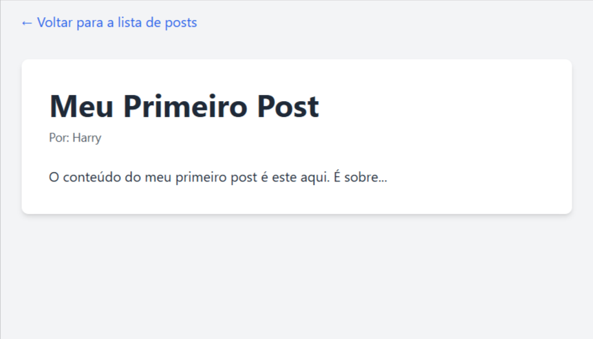

# Blog com Flask

Este é um projeto de blog (em desenvolvimento) desenvolvido com **Flask** para demonstrar os conceitos iniciais de um web framework, como roteamento, templates com Jinja2, e estilização com Tailwind CSS. É a base ideal para quem busca criar aplicações web dinâmicas e aprender os fundamentos de um backend.

### Home


### Post


## Funcionalidades

- Exibe uma lista de posts estáticos na página inicial.
- Permite a navegação para uma página individual de cada post via URL dinâmica.
- Layout responsivo estilizado com **Tailwind CSS via CDN**.

## Tecnologias Utilizadas

- **Python 3.x**
- **Flask**: Framework web para Python.
- **Jinja2**: Motor de templates do Flask.
- **Tailwind CSS**: Framework de CSS para estilização via CDN.

## Estrutura do Projeto
```
blog/
├── app.py
├── requirements.txt
├── templates/
│   ├── index.html
│   └── post.html
├── static/
└── src/
└── img/
    ├── blog_index.png
    └── blog_post.png
```

## Como Rodar o Projeto

1. Clone este repositório:
   ```bash
   git clone <URL_DO_SEU_REPOSITORIO>
   cd blog
   ```
   
2. Crie e ative um ambiente virtual:
   ```bash
   python -m venv venv
   ```
   - Windows
        ```
        venv\Scripts\activate
        ```

   - Linux/Mac
        ```
        source venv/bin/activatevenv\Scripts\activate
        ```

3. Instale as dependências
    ```
    pip install -r requirements.txt
    ```

4. Inicie o servidor
    ```
    python app.py
    ```

## Possíveis Melhorias Futuras
1. Persistência de dados utilizando banco de dados (SQLite com Flask-SQLAlchemy).

2. Criação de posts via formulário.

3. Autenticação de usuários.

4. Refatoração para uma estrutura modular com Blueprints.

## Licença
Este projeto está sob a licença MIT.
