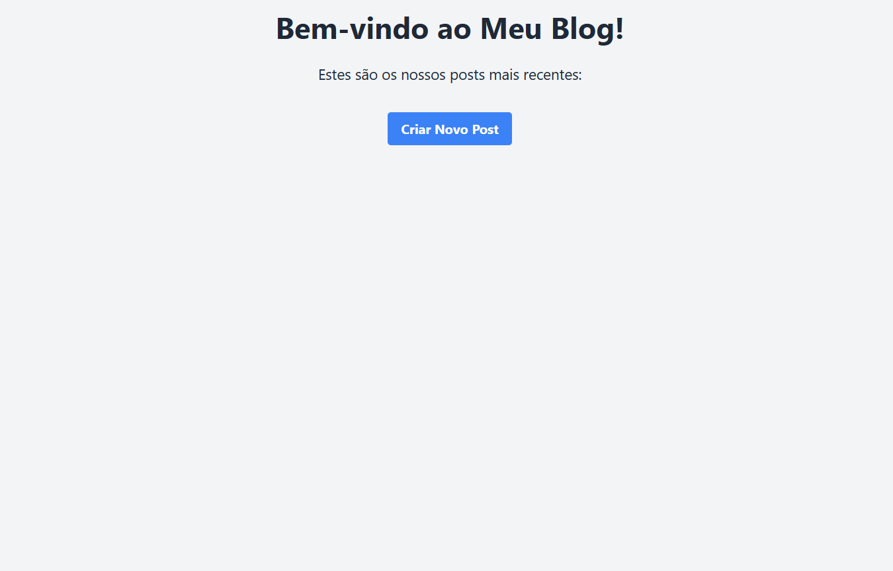

# Blog com Flask

Este é um projeto de blog desenvolvido com **Flask** para demonstrar os conceitos iniciais de um web framework, como roteamento, templates com Jinja2, estilização com Tailwind CSS e persistência de dados com SQLALchemy. É a base ideal para quem busca criar aplicações web dinâmicas e aprender os fundamentos de um backend.

### Home


### Criação de Post


### Demonstração de Posts


## Funcionalidades

- Exibe uma lista de posts estáticos na página inicial.
- Permite a navegação para uma página individual de cada post via URL dinâmica.
- Layout responsivo estilizado com **Tailwind CSS via CDN**.

## Tecnologias Utilizadas

- **Python 3.x**
- **Flask**: Framework web para Python.
- **Jinja2**: Motor de templates do Flask.
- **Tailwind CSS**: Framework de CSS para estilização via CDN.
- **SQLAlchemy**: Persistência de dados utilizando banco de dados (SQLite com Flask-SQLAlchemy). 

## Estrutura do Projeto
```
.
├── app
│   ├── templates
│   │   ├── index.html
│   │   ├── novo_post.html
│   │   └── post.html
│   ├── __init__.py
│   ├── forms.py
│   ├── models.py
│   └── routes.py
├── src
│   └── img
│       ├── blog_index.png
│       ├── blog_novo_post.png
│       └── blog_posts.png
├── .gitignore
├── LICENSE
├── README.md
├── requirements.txt
└── run.py
```

## Como Rodar o Projeto

1. Clone este repositório:
   ```bash
   git clone <URL_DO_SEU_REPOSITORIO>
   cd blog
   ```
   
2. Crie e ative um ambiente virtual:
   ```bash
   python -m venv venv
   ```
   - Windows
        ```
        venv\Scripts\activate
        ```

   - Linux/Mac
        ```
        source venv/bin/activatevenv\Scripts\activate
        ```

3. Instale as dependências
    ```
    pip install -r requirements.txt
    ```

4. Inicie o servidor
    ```
    python app.py
    ```

## Possíveis Melhorias Futuras

1. Autenticação de usuários.

2. Refatoração para uma estrutura modular com Blueprints.

## Licença
Este projeto está sob a licença MIT.
